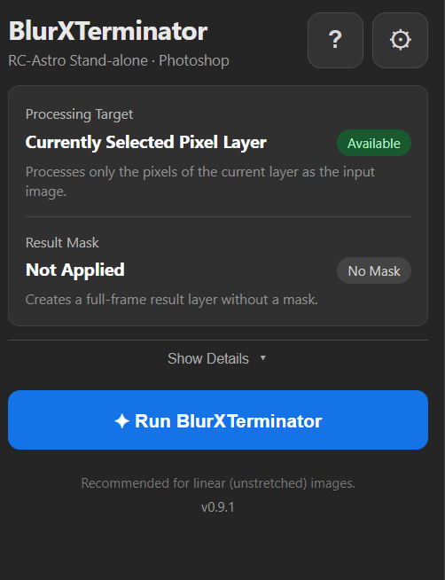
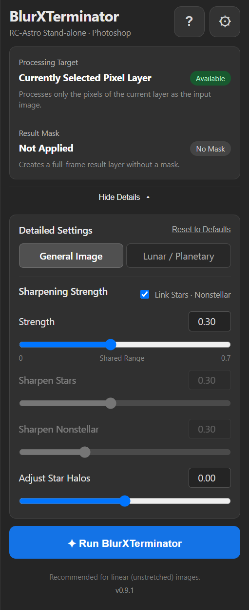
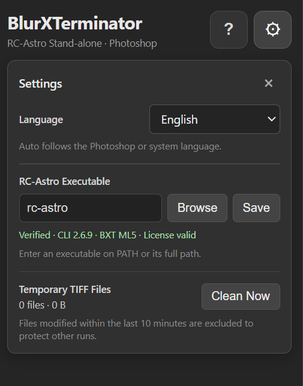
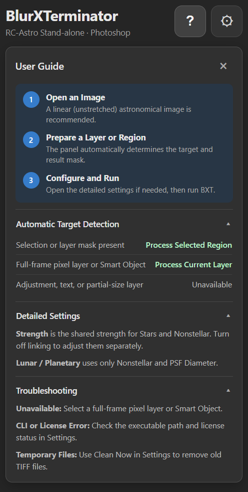
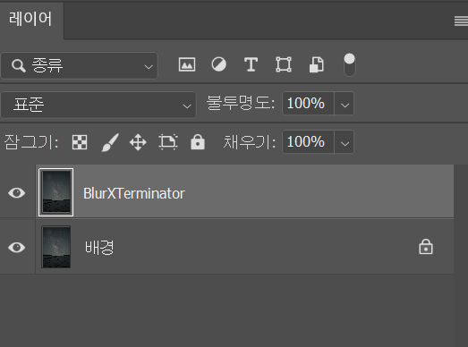

# RC-Astro BlurXTerminator Photoshop Panel

**English** | [한국어](README_KO.md)

A Windows CEP panel that runs BlurXTerminator through the RC-Astro Stand-alone CLI in Adobe Photoshop and imports the result as a new layer.

Current version: **v0.9.2**

> RC-Astro CLI, BlurXTerminator models, and product licenses are not included. Install and activate them separately.

## Preview

<p align="center"></p>

<p align="center"><em>The processing target and result mask are determined automatically from the current Photoshop state.</em></p>

<details>
<summary><strong>View detailed settings, preferences, and help</strong></summary>
<br>
<table>
  <tr><th>Detailed settings</th><th>Preferences</th></tr>
  <tr>
    <td></td>
    <td></td>
  </tr>
  <tr><th>In-panel help</th><th>Result layer</th></tr>
  <tr>
    <td></td>
    <td></td>
  </tr>
</table>
</details>

## Features

- Exports the current Photoshop layer as a 32-bit TIFF for BXT processing
- Restores the original color mode and bit depth and inserts the result as a new layer
- Supports selection or layer-mask based regional processing
- Supports Lunar / Planetary mode and PSF Diameter
- Checks the CLI version, ML version, and license status before processing
- Supports cancellation and automatic temporary TIFF cleanup
- Provides in-panel help and troubleshooting
- Detects the system language and supports Korean and English UI

## Requirements

- Windows
- Adobe Photoshop with CEP Extensions (Legacy) support
- RC-Astro Stand-alone CLI
- An activated BlurXTerminator license
- BlurXTerminator ML5 or later for Lunar / Planetary mode

Verify this command in Command Prompt:

```text
rc-astro bxt
```

## Installation

1. Close Photoshop completely.
2. Download the repository or extract the release ZIP.
3. Run `Install_Windows.bat`.
4. Restart Photoshop.
5. Open `Window → Extensions (Legacy) → RC-Astro BlurXTerminator`.

The installer detects the Windows display language and lets you select Korean or English. To skip the prompt, use `Install_Windows.bat --lang=en` or `Install_Windows.bat --lang=ko`. The uninstaller supports the same options.

Installation folder:

```text
%APPDATA%\Adobe\CEP\extensions\RC-Astro-BXT-Panel
```

The installer also sets `PlayerDebugMode=1` for CSXS 9–15 under the current user account so the unsigned CEP extension can load.

## Usage

1. Open a linear (unstretched) astrophotography image.
2. In Settings, verify the language, RC-Astro CLI, and license status.
3. Check the automatically selected processing target and result mask.
4. Open `Show detailed settings` if you need to adjust the values.
5. Select `Run BlurXTerminator`.

The `?` button provides the same instructions inside the panel.

## Automatic Target Selection

| Photoshop state | Processing behavior |
|---|---|
| Active selection | Processes visible layers and applies the selection as the result mask |
| Current layer has a mask | Processes visible layers and applies the layer mask to the result |
| Full-frame pixel layer or Smart Object | Processes only the current layer |
| Adjustment, text, group, or partial-size layer | Blocks processing and marks the target unavailable |

A selection takes priority when both a selection and a layer mask exist.

## Detailed Settings

### General Image

- Strength: shared Stars and Nonstellar value, `0–0.7`
- Sharpen Stars: `0–0.7`
- Sharpen Nonstellar: `0–1.0`
- Adjust Star Halos: `-0.5–0.5`
- Disable linking to adjust Stars and Nonstellar independently.

### Lunar / Planetary

- Sharpen Nonstellar
- PSF Diameter: `0.1–8.0 px`
- Stars and Halos are not used in this mode.

## Cancellation and Temporary Files

- `Cancel processing` terminates the active RC-Astro process.
- TIFF files are cleaned after success, failure, cancellation, and panel closure.
- `Clean now` removes old temporary TIFF files.
- Files from the last 10 minutes are excluded to protect other active runs.

## Uninstallation

1. Close Photoshop completely.
2. Run `Uninstall_Windows.bat`.
3. Choose whether to remove `PlayerDebugMode`.

`PlayerDebugMode` is shared by unsigned CEP extensions. Keep the default `N` if another CEP panel still uses it.

## Tests

The panel passed 14 integration tests on Photoshop 27.8.0, including document identification, color mode and bit-depth restoration, layer processing, selections, masks, and TIFF round trips.

```text
tests\Run_Photoshop_Integration.ps1
node tests\i18n-smoke.js
powershell -NoProfile -ExecutionPolicy Bypass -File .\tests\Test_Installer_Languages.ps1
```

The Photoshop integration test requires Photoshop to be installed and running.

## License

This panel is distributed under the [GNU General Public License v3.0](LICENSE).

RC-Astro Stand-alone CLI, BlurXTerminator, and Adobe Photoshop are not included and remain subject to their respective licenses and terms.
